# Hinatazaka46 Blog Archive Data (日向坂46メンバーのブログアーカイブデータ)

This repository automatically archives official diaries from Hinatazaka46 members, compresses image assets to optimize storage efficiency, and compiles Japanese text into dynamic Hiragana Furigana tags using morphological analysis.

The archiving process runs periodically via GitHub Actions, establishing a persistent, self-updating, and high-performance Japanese learning and reading resource.

## Project Contribution Calendar

This calendar displays the total crawled blog posts across all members over the past year (53 weeks):

### 2026 Contribution Calendar

This grid displays the total crawled blog posts across all members during the year 2026 (Total: 1198 posts):

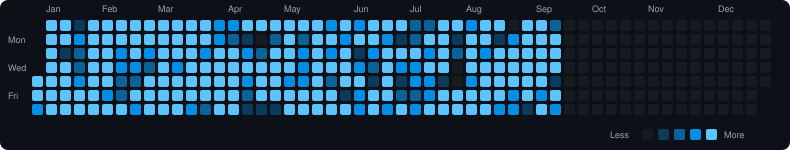

### Archive & Previous Years

Click on any year below to view the activity heatmap archive for that year:

<details>
  <summary><b>Year 2025 Activity Calendar (1729 blog posts)</b></summary>
  <br/>
  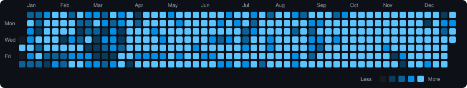
</details>

<details>
  <summary><b>Year 2024 Activity Calendar (1077 blog posts)</b></summary>
  <br/>
  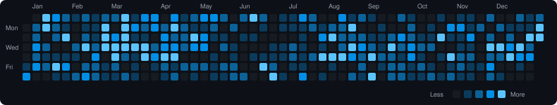
</details>

<details>
  <summary><b>Year 2023 Activity Calendar (1100 blog posts)</b></summary>
  <br/>
  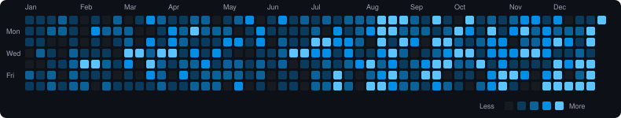
</details>

<details>
  <summary><b>Year 2022 Activity Calendar (588 blog posts)</b></summary>
  <br/>
  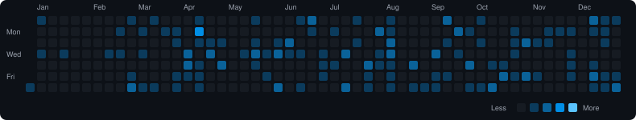
</details>

<details>
  <summary><b>Year 2021 Activity Calendar (631 blog posts)</b></summary>
  <br/>
  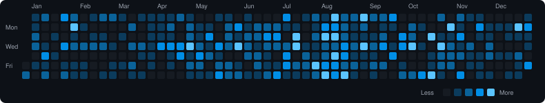
</details>

<details>
  <summary><b>Year 2020 Activity Calendar (440 blog posts)</b></summary>
  <br/>
  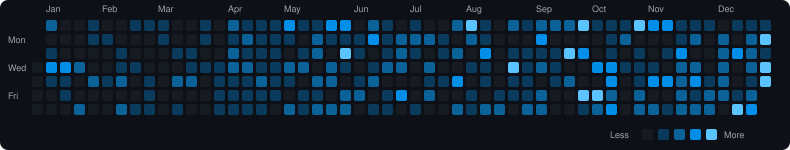
</details>

<details>
  <summary><b>Year 2019 Activity Calendar (303 blog posts)</b></summary>
  <br/>
  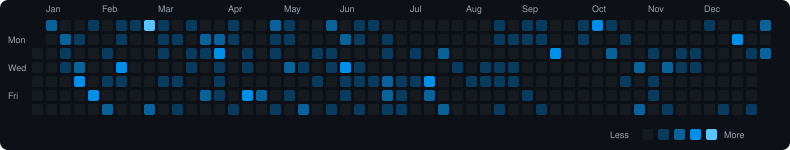
</details>

<details>
  <summary><b>Year 2018 Activity Calendar (185 blog posts)</b></summary>
  <br/>
  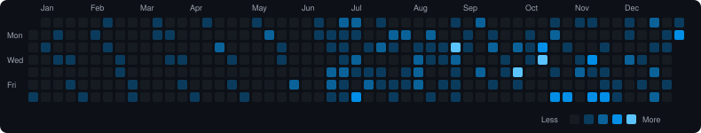
</details>

<details>
  <summary><b>Year 2017 Activity Calendar (8 blog posts)</b></summary>
  <br/>
  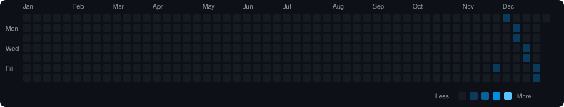
</details>


## Member Statistics and Activity

- Total active members: 28
- Total archived blog posts: 7259
- Total optimized images: 35717
- Database last updated: 8/29/2026, 16:55:56 (Indochina Time)

### Member Progress Dashboard

| No | Member Name | Romaji Slug | 30-Day Activity Sparkline | Total Posts | Oldest Post | Newest Post |
| --- | --- | --- | --- | --- | --- | --- |
| 1 | 石塚 瑶季 | [ishizuka.tamaki](public/images/contributions/ishizuka.tamaki/2026.svg) |  | 303 | 2022.10.26 12:00 | 2026.8.26 20:50 |
| 2 | 大田 美月 | [ota.mitsuki](public/images/contributions/ota.mitsuki/2026.svg) |  | 215 | 2025.4.14 18:05 | 2026.8.29 15:02 |
| 3 | 大野 愛実 | [ono.manami](public/images/contributions/ono.manami/2026.svg) |  | 54 | 2025.4.8 18:00 | 2026.8.18 14:22 |
| 4 | 片山 紗希 | [katayama.saki](public/images/contributions/katayama.saki/2026.svg) |  | 215 | 2025.4.13 15:12 | 2026.8.28 12:03 |
| 5 | 金村 美玖 | [kanemura.miku](public/images/contributions/kanemura.miku/2026.svg) |  | 634 | 2017.12.1 18:00 | 2026.8.24 14:34 |
| 6 | 上村 ひなの | [kamimura.hinano](public/images/contributions/kamimura.hinano/2026.svg) |  | 969 | 2019.2.14 20:49 | 2026.8.15 12:13 |
| 7 | 蔵盛 妃那乃 | [kuramori.hinano](public/images/contributions/kuramori.hinano/2026.svg) |  | 107 | 2025.4.17 16:55 | 2026.8.27 12:52 |
| 8 | 小坂 菜緒 | [kosaka.nao](public/images/contributions/kosaka.nao/2026.svg) |  | 202 | 2017.12.3 23:07 | 2026.8.12 20:41 |
| 9 | 小西 夏菜実 | [konishi.nanami](public/images/contributions/konishi.nanami/2026.svg) |  | 215 | 2022.10.28 12:00 | 2026.8.19 18:36 |
| 10 | 坂井 新奈 | [sakai.niina](public/images/contributions/sakai.niina/2026.svg) |  | 98 | 2025.4.10 19:00 | 2026.8.26 18:14 |
| 11 | 佐藤 優羽 | [sato.yuu](public/images/contributions/sato.yuu/2026.svg) |  | 123 | 2025.4.11 20:22 | 2026.8.29 18:00 |
| 12 | 清水 理央 | [shimizu.rio](public/images/contributions/shimizu.rio/2026.svg) |  | 136 | 2022.10.29 12:00 | 2026.8.27 17:00 |
| 13 | 下田 衣珠季 | [shimoda.izuki](public/images/contributions/shimoda.izuki/2026.svg) |  | 71 | 2025.4.12 19:12 | 2026.8.26 18:06 |
| 14 | 正源司 陽子 | [shogenji.yoko](public/images/contributions/shogenji.yoko/2026.svg) |  | 131 | 2022.10.30 12:11 | 2026.8.10 09:58 |
| 15 | 高井 俐香 | [takai.rika](public/images/contributions/takai.rika/2026.svg) |  | 115 | 2025.4.15 19:56 | 2026.8.28 15:00 |
| 16 | 髙橋 未来虹 | [takahashi.mikuni](public/images/contributions/takahashi.mikuni/2026.svg) |  | 495 | 2020.4.6 15:46 | 2026.8.15 12:43 |
| 17 | 竹内 希来里 | [takeuchi.kirari](public/images/contributions/takeuchi.kirari/2026.svg) |  | 116 | 2022.10.31 12:00 | 2026.8.24 16:29 |
| 18 | 鶴崎 仁香 | [tsurusaki.nika](public/images/contributions/tsurusaki.nika/2026.svg) |  | 161 | 2025.4.9 18:00 | 2026.8.26 21:06 |
| 19 | 平尾 帆夏 | [hirao.honoka](public/images/contributions/hirao.honoka/2026.svg) |  | 222 | 2022.11.1 12:11 | 2026.8.25 12:51 |
| 20 | 平岡 海月 | [hiraoka.mitsuki](public/images/contributions/hiraoka.mitsuki/2026.svg) |  | 114 | 2022.11.2 12:00 | 2026.8.12 15:10 |
| 21 | 藤嶌 果歩 | [fujishima.kaho](public/images/contributions/fujishima.kaho/2026.svg) |  | 295 | 2022.11.3 12:00 | 2026.8.19 20:13 |
| 22 | 松尾 桜 | [matsuo.sakura](public/images/contributions/matsuo.sakura/2026.svg) |  | 97 | 2025.4.16 20:53 | 2026.8.28 12:01 |
| 23 | 宮地 すみれ | [miyachi.sumire](public/images/contributions/miyachi.sumire/2026.svg) |  | 214 | 2022.11.4 12:00 | 2026.8.27 12:49 |
| 24 | 森本 茉莉 | [morimoto.marie](public/images/contributions/morimoto.marie/2026.svg) |  | 548 | 2020.4.7 12:30 | 2026.8.15 13:15 |
| 25 | 山口 陽世 | [yamaguchi.haruyo](public/images/contributions/yamaguchi.haruyo/2026.svg) |  | 592 | 2020.4.8 14:43 | 2026.8.14 16:34 |
| 26 | 山下 葉留花 | [yamashita.haruka](public/images/contributions/yamashita.haruka/2026.svg) |  | 241 | 2022.11.5 12:00 | 2026.8.26 18:12 |
| 27 | 渡辺 莉奈 | [watanabe.rina](public/images/contributions/watanabe.rina/2026.svg) |  | 165 | 2022.11.6 12:00 | 2026.8.16 20:56 |
| 28 | ポカ | [poka](public/images/contributions/poka/2026.svg) |  | 411 | 2021.5.25 20:00 | 2026.8.27 14:37 |


### Member Contribution Heatmaps (2026)

Click on any member below to view their detailed blog contribution heatmap for the year 2026:

<details>
  <summary><b>石塚 瑶季 (ishizuka.tamaki) - Year 2026 Activity Calendar (52 blog posts)</b></summary>
  <br/>
  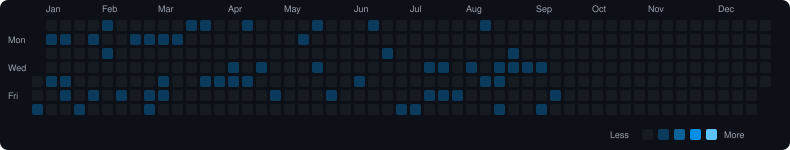
  <br/>
  <details>
    <summary><i>View Other Years Archive for 石塚 瑶季</i></summary>
    <br/>
    <ul>
      <li><a href="public/images/contributions/ishizuka.tamaki/2025.svg">Year 2025 Activity Calendar (99 blog posts)</a></li>
      <li><a href="public/images/contributions/ishizuka.tamaki/2024.svg">Year 2024 Activity Calendar (71 blog posts)</a></li>
      <li><a href="public/images/contributions/ishizuka.tamaki/2023.svg">Year 2023 Activity Calendar (75 blog posts)</a></li>
      <li><a href="public/images/contributions/ishizuka.tamaki/2022.svg">Year 2022 Activity Calendar (6 blog posts)</a></li>
    </ul>
  </details>
</details>

<details>
  <summary><b>大田 美月 (ota.mitsuki) - Year 2026 Activity Calendar (133 blog posts)</b></summary>
  <br/>
  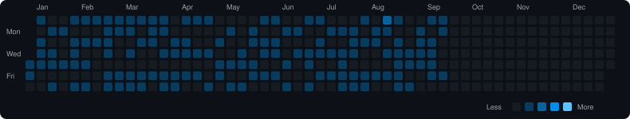
  <br/>
  <details>
    <summary><i>View Other Years Archive for 大田 美月</i></summary>
    <br/>
    <ul>
      <li><a href="public/images/contributions/ota.mitsuki/2025.svg">Year 2025 Activity Calendar (82 blog posts)</a></li>
    </ul>
  </details>
</details>

<details>
  <summary><b>大野 愛実 (ono.manami) - Year 2026 Activity Calendar (23 blog posts)</b></summary>
  <br/>
  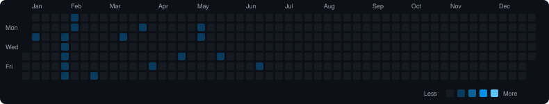
  <br/>
  <details>
    <summary><i>View Other Years Archive for 大野 愛実</i></summary>
    <br/>
    <ul>
      <li><a href="public/images/contributions/ono.manami/2025.svg">Year 2025 Activity Calendar (31 blog posts)</a></li>
    </ul>
  </details>
</details>

<details>
  <summary><b>片山 紗希 (katayama.saki) - Year 2026 Activity Calendar (138 blog posts)</b></summary>
  <br/>
  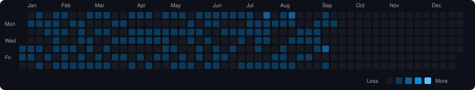
  <br/>
  <details>
    <summary><i>View Other Years Archive for 片山 紗希</i></summary>
    <br/>
    <ul>
      <li><a href="public/images/contributions/katayama.saki/2025.svg">Year 2025 Activity Calendar (77 blog posts)</a></li>
    </ul>
  </details>
</details>

<details>
  <summary><b>金村 美玖 (kanemura.miku) - Year 2026 Activity Calendar (23 blog posts)</b></summary>
  <br/>
  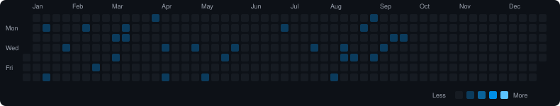
  <br/>
  <details>
    <summary><i>View Other Years Archive for 金村 美玖</i></summary>
    <br/>
    <ul>
      <li><a href="public/images/contributions/kanemura.miku/2025.svg">Year 2025 Activity Calendar (45 blog posts)</a></li>
      <li><a href="public/images/contributions/kanemura.miku/2024.svg">Year 2024 Activity Calendar (64 blog posts)</a></li>
      <li><a href="public/images/contributions/kanemura.miku/2023.svg">Year 2023 Activity Calendar (69 blog posts)</a></li>
      <li><a href="public/images/contributions/kanemura.miku/2022.svg">Year 2022 Activity Calendar (55 blog posts)</a></li>
      <li><a href="public/images/contributions/kanemura.miku/2021.svg">Year 2021 Activity Calendar (69 blog posts)</a></li>
      <li><a href="public/images/contributions/kanemura.miku/2020.svg">Year 2020 Activity Calendar (72 blog posts)</a></li>
      <li><a href="public/images/contributions/kanemura.miku/2019.svg">Year 2019 Activity Calendar (135 blog posts)</a></li>
      <li><a href="public/images/contributions/kanemura.miku/2018.svg">Year 2018 Activity Calendar (98 blog posts)</a></li>
      <li><a href="public/images/contributions/kanemura.miku/2017.svg">Year 2017 Activity Calendar (4 blog posts)</a></li>
    </ul>
  </details>
</details>

<details>
  <summary><b>上村 ひなの (kamimura.hinano) - Year 2026 Activity Calendar (32 blog posts)</b></summary>
  <br/>
  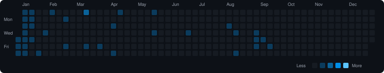
  <br/>
  <details>
    <summary><i>View Other Years Archive for 上村 ひなの</i></summary>
    <br/>
    <ul>
      <li><a href="public/images/contributions/kamimura.hinano/2025.svg">Year 2025 Activity Calendar (356 blog posts)</a></li>
      <li><a href="public/images/contributions/kamimura.hinano/2024.svg">Year 2024 Activity Calendar (63 blog posts)</a></li>
      <li><a href="public/images/contributions/kamimura.hinano/2023.svg">Year 2023 Activity Calendar (68 blog posts)</a></li>
      <li><a href="public/images/contributions/kamimura.hinano/2022.svg">Year 2022 Activity Calendar (96 blog posts)</a></li>
      <li><a href="public/images/contributions/kamimura.hinano/2021.svg">Year 2021 Activity Calendar (129 blog posts)</a></li>
      <li><a href="public/images/contributions/kamimura.hinano/2020.svg">Year 2020 Activity Calendar (100 blog posts)</a></li>
      <li><a href="public/images/contributions/kamimura.hinano/2019.svg">Year 2019 Activity Calendar (125 blog posts)</a></li>
    </ul>
  </details>
</details>

<details>
  <summary><b>蔵盛 妃那乃 (kuramori.hinano) - Year 2026 Activity Calendar (67 blog posts)</b></summary>
  <br/>
  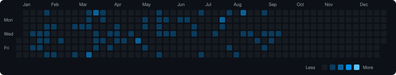
  <br/>
  <details>
    <summary><i>View Other Years Archive for 蔵盛 妃那乃</i></summary>
    <br/>
    <ul>
      <li><a href="public/images/contributions/kuramori.hinano/2025.svg">Year 2025 Activity Calendar (40 blog posts)</a></li>
    </ul>
  </details>
</details>

<details>
  <summary><b>小坂 菜緒 (kosaka.nao) - Year 2026 Activity Calendar (4 blog posts)</b></summary>
  <br/>
  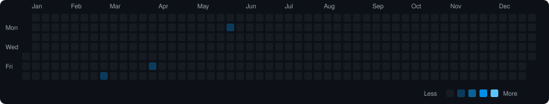
  <br/>
  <details>
    <summary><i>View Other Years Archive for 小坂 菜緒</i></summary>
    <br/>
    <ul>
      <li><a href="public/images/contributions/kosaka.nao/2025.svg">Year 2025 Activity Calendar (8 blog posts)</a></li>
      <li><a href="public/images/contributions/kosaka.nao/2024.svg">Year 2024 Activity Calendar (9 blog posts)</a></li>
      <li><a href="public/images/contributions/kosaka.nao/2023.svg">Year 2023 Activity Calendar (11 blog posts)</a></li>
      <li><a href="public/images/contributions/kosaka.nao/2022.svg">Year 2022 Activity Calendar (12 blog posts)</a></li>
      <li><a href="public/images/contributions/kosaka.nao/2021.svg">Year 2021 Activity Calendar (6 blog posts)</a></li>
      <li><a href="public/images/contributions/kosaka.nao/2020.svg">Year 2020 Activity Calendar (18 blog posts)</a></li>
      <li><a href="public/images/contributions/kosaka.nao/2019.svg">Year 2019 Activity Calendar (43 blog posts)</a></li>
      <li><a href="public/images/contributions/kosaka.nao/2018.svg">Year 2018 Activity Calendar (87 blog posts)</a></li>
      <li><a href="public/images/contributions/kosaka.nao/2017.svg">Year 2017 Activity Calendar (4 blog posts)</a></li>
    </ul>
  </details>
</details>

<details>
  <summary><b>小西 夏菜実 (konishi.nanami) - Year 2026 Activity Calendar (20 blog posts)</b></summary>
  <br/>
  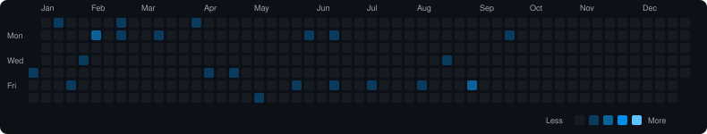
  <br/>
  <details>
    <summary><i>View Other Years Archive for 小西 夏菜実</i></summary>
    <br/>
    <ul>
      <li><a href="public/images/contributions/konishi.nanami/2025.svg">Year 2025 Activity Calendar (63 blog posts)</a></li>
      <li><a href="public/images/contributions/konishi.nanami/2024.svg">Year 2024 Activity Calendar (77 blog posts)</a></li>
      <li><a href="public/images/contributions/konishi.nanami/2023.svg">Year 2023 Activity Calendar (49 blog posts)</a></li>
      <li><a href="public/images/contributions/konishi.nanami/2022.svg">Year 2022 Activity Calendar (6 blog posts)</a></li>
    </ul>
  </details>
</details>

<details>
  <summary><b>坂井 新奈 (sakai.niina) - Year 2026 Activity Calendar (54 blog posts)</b></summary>
  <br/>
  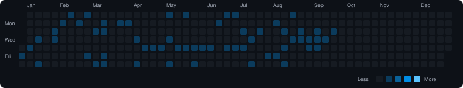
  <br/>
  <details>
    <summary><i>View Other Years Archive for 坂井 新奈</i></summary>
    <br/>
    <ul>
      <li><a href="public/images/contributions/sakai.niina/2025.svg">Year 2025 Activity Calendar (44 blog posts)</a></li>
    </ul>
  </details>
</details>

<details>
  <summary><b>佐藤 優羽 (sato.yuu) - Year 2026 Activity Calendar (79 blog posts)</b></summary>
  <br/>
  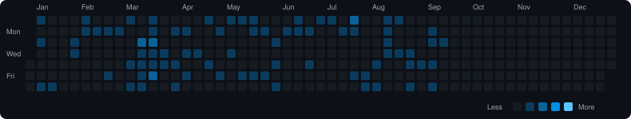
  <br/>
  <details>
    <summary><i>View Other Years Archive for 佐藤 優羽</i></summary>
    <br/>
    <ul>
      <li><a href="public/images/contributions/sato.yuu/2025.svg">Year 2025 Activity Calendar (44 blog posts)</a></li>
    </ul>
  </details>
</details>

<details>
  <summary><b>清水 理央 (shimizu.rio) - Year 2026 Activity Calendar (15 blog posts)</b></summary>
  <br/>
  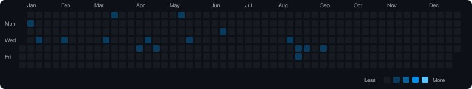
  <br/>
  <details>
    <summary><i>View Other Years Archive for 清水 理央</i></summary>
    <br/>
    <ul>
      <li><a href="public/images/contributions/shimizu.rio/2025.svg">Year 2025 Activity Calendar (23 blog posts)</a></li>
      <li><a href="public/images/contributions/shimizu.rio/2024.svg">Year 2024 Activity Calendar (54 blog posts)</a></li>
      <li><a href="public/images/contributions/shimizu.rio/2023.svg">Year 2023 Activity Calendar (39 blog posts)</a></li>
      <li><a href="public/images/contributions/shimizu.rio/2022.svg">Year 2022 Activity Calendar (5 blog posts)</a></li>
    </ul>
  </details>
</details>

<details>
  <summary><b>下田 衣珠季 (shimoda.izuki) - Year 2026 Activity Calendar (36 blog posts)</b></summary>
  <br/>
  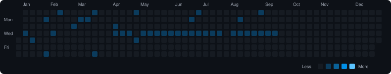
  <br/>
  <details>
    <summary><i>View Other Years Archive for 下田 衣珠季</i></summary>
    <br/>
    <ul>
      <li><a href="public/images/contributions/shimoda.izuki/2025.svg">Year 2025 Activity Calendar (35 blog posts)</a></li>
    </ul>
  </details>
</details>

<details>
  <summary><b>正源司 陽子 (shogenji.yoko) - Year 2026 Activity Calendar (18 blog posts)</b></summary>
  <br/>
  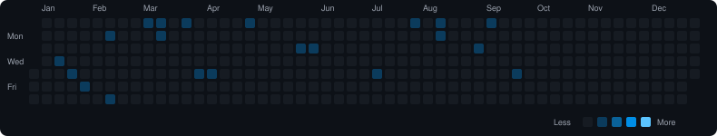
  <br/>
  <details>
    <summary><i>View Other Years Archive for 正源司 陽子</i></summary>
    <br/>
    <ul>
      <li><a href="public/images/contributions/shogenji.yoko/2025.svg">Year 2025 Activity Calendar (31 blog posts)</a></li>
      <li><a href="public/images/contributions/shogenji.yoko/2024.svg">Year 2024 Activity Calendar (35 blog posts)</a></li>
      <li><a href="public/images/contributions/shogenji.yoko/2023.svg">Year 2023 Activity Calendar (41 blog posts)</a></li>
      <li><a href="public/images/contributions/shogenji.yoko/2022.svg">Year 2022 Activity Calendar (6 blog posts)</a></li>
    </ul>
  </details>
</details>

<details>
  <summary><b>高井 俐香 (takai.rika) - Year 2026 Activity Calendar (68 blog posts)</b></summary>
  <br/>
  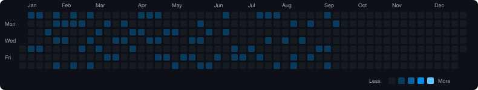
  <br/>
  <details>
    <summary><i>View Other Years Archive for 高井 俐香</i></summary>
    <br/>
    <ul>
      <li><a href="public/images/contributions/takai.rika/2025.svg">Year 2025 Activity Calendar (47 blog posts)</a></li>
    </ul>
  </details>
</details>

<details>
  <summary><b>髙橋 未来虹 (takahashi.mikuni) - Year 2026 Activity Calendar (29 blog posts)</b></summary>
  <br/>
  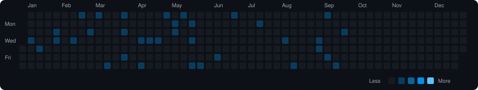
  <br/>
  <details>
    <summary><i>View Other Years Archive for 髙橋 未来虹</i></summary>
    <br/>
    <ul>
      <li><a href="public/images/contributions/takahashi.mikuni/2025.svg">Year 2025 Activity Calendar (41 blog posts)</a></li>
      <li><a href="public/images/contributions/takahashi.mikuni/2024.svg">Year 2024 Activity Calendar (62 blog posts)</a></li>
      <li><a href="public/images/contributions/takahashi.mikuni/2023.svg">Year 2023 Activity Calendar (101 blog posts)</a></li>
      <li><a href="public/images/contributions/takahashi.mikuni/2022.svg">Year 2022 Activity Calendar (75 blog posts)</a></li>
      <li><a href="public/images/contributions/takahashi.mikuni/2021.svg">Year 2021 Activity Calendar (103 blog posts)</a></li>
      <li><a href="public/images/contributions/takahashi.mikuni/2020.svg">Year 2020 Activity Calendar (84 blog posts)</a></li>
    </ul>
  </details>
</details>

<details>
  <summary><b>竹内 希来里 (takeuchi.kirari) - Year 2026 Activity Calendar (17 blog posts)</b></summary>
  <br/>
  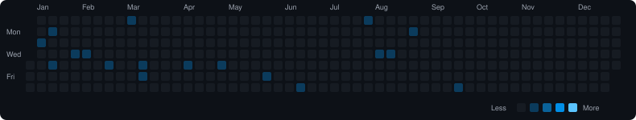
  <br/>
  <details>
    <summary><i>View Other Years Archive for 竹内 希来里</i></summary>
    <br/>
    <ul>
      <li><a href="public/images/contributions/takeuchi.kirari/2025.svg">Year 2025 Activity Calendar (30 blog posts)</a></li>
      <li><a href="public/images/contributions/takeuchi.kirari/2024.svg">Year 2024 Activity Calendar (33 blog posts)</a></li>
      <li><a href="public/images/contributions/takeuchi.kirari/2023.svg">Year 2023 Activity Calendar (30 blog posts)</a></li>
      <li><a href="public/images/contributions/takeuchi.kirari/2022.svg">Year 2022 Activity Calendar (6 blog posts)</a></li>
    </ul>
  </details>
</details>

<details>
  <summary><b>鶴崎 仁香 (tsurusaki.nika) - Year 2026 Activity Calendar (103 blog posts)</b></summary>
  <br/>
  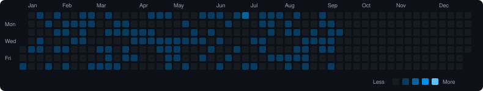
  <br/>
  <details>
    <summary><i>View Other Years Archive for 鶴崎 仁香</i></summary>
    <br/>
    <ul>
      <li><a href="public/images/contributions/tsurusaki.nika/2025.svg">Year 2025 Activity Calendar (58 blog posts)</a></li>
    </ul>
  </details>
</details>

<details>
  <summary><b>平尾 帆夏 (hirao.honoka) - Year 2026 Activity Calendar (24 blog posts)</b></summary>
  <br/>
  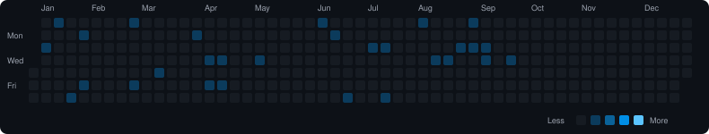
  <br/>
  <details>
    <summary><i>View Other Years Archive for 平尾 帆夏</i></summary>
    <br/>
    <ul>
      <li><a href="public/images/contributions/hirao.honoka/2025.svg">Year 2025 Activity Calendar (52 blog posts)</a></li>
      <li><a href="public/images/contributions/hirao.honoka/2024.svg">Year 2024 Activity Calendar (77 blog posts)</a></li>
      <li><a href="public/images/contributions/hirao.honoka/2023.svg">Year 2023 Activity Calendar (63 blog posts)</a></li>
      <li><a href="public/images/contributions/hirao.honoka/2022.svg">Year 2022 Activity Calendar (6 blog posts)</a></li>
    </ul>
  </details>
</details>

<details>
  <summary><b>平岡 海月 (hiraoka.mitsuki) - Year 2026 Activity Calendar (8 blog posts)</b></summary>
  <br/>
  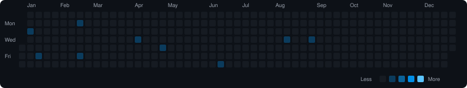
  <br/>
  <details>
    <summary><i>View Other Years Archive for 平岡 海月</i></summary>
    <br/>
    <ul>
      <li><a href="public/images/contributions/hiraoka.mitsuki/2025.svg">Year 2025 Activity Calendar (14 blog posts)</a></li>
      <li><a href="public/images/contributions/hiraoka.mitsuki/2024.svg">Year 2024 Activity Calendar (43 blog posts)</a></li>
      <li><a href="public/images/contributions/hiraoka.mitsuki/2023.svg">Year 2023 Activity Calendar (44 blog posts)</a></li>
      <li><a href="public/images/contributions/hiraoka.mitsuki/2022.svg">Year 2022 Activity Calendar (5 blog posts)</a></li>
    </ul>
  </details>
</details>

<details>
  <summary><b>藤嶌 果歩 (fujishima.kaho) - Year 2026 Activity Calendar (51 blog posts)</b></summary>
  <br/>
  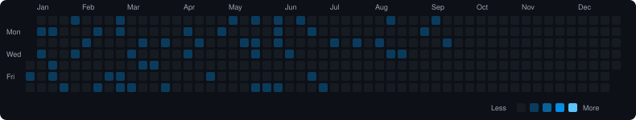
  <br/>
  <details>
    <summary><i>View Other Years Archive for 藤嶌 果歩</i></summary>
    <br/>
    <ul>
      <li><a href="public/images/contributions/fujishima.kaho/2025.svg">Year 2025 Activity Calendar (110 blog posts)</a></li>
      <li><a href="public/images/contributions/fujishima.kaho/2024.svg">Year 2024 Activity Calendar (82 blog posts)</a></li>
      <li><a href="public/images/contributions/fujishima.kaho/2023.svg">Year 2023 Activity Calendar (47 blog posts)</a></li>
      <li><a href="public/images/contributions/fujishima.kaho/2022.svg">Year 2022 Activity Calendar (5 blog posts)</a></li>
    </ul>
  </details>
</details>

<details>
  <summary><b>松尾 桜 (matsuo.sakura) - Year 2026 Activity Calendar (49 blog posts)</b></summary>
  <br/>
  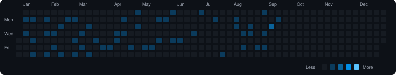
  <br/>
  <details>
    <summary><i>View Other Years Archive for 松尾 桜</i></summary>
    <br/>
    <ul>
      <li><a href="public/images/contributions/matsuo.sakura/2025.svg">Year 2025 Activity Calendar (48 blog posts)</a></li>
    </ul>
  </details>
</details>

<details>
  <summary><b>宮地 すみれ (miyachi.sumire) - Year 2026 Activity Calendar (21 blog posts)</b></summary>
  <br/>
  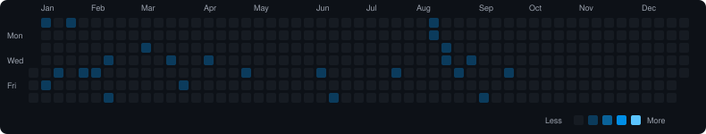
  <br/>
  <details>
    <summary><i>View Other Years Archive for 宮地 すみれ</i></summary>
    <br/>
    <ul>
      <li><a href="public/images/contributions/miyachi.sumire/2025.svg">Year 2025 Activity Calendar (78 blog posts)</a></li>
      <li><a href="public/images/contributions/miyachi.sumire/2024.svg">Year 2024 Activity Calendar (56 blog posts)</a></li>
      <li><a href="public/images/contributions/miyachi.sumire/2023.svg">Year 2023 Activity Calendar (54 blog posts)</a></li>
      <li><a href="public/images/contributions/miyachi.sumire/2022.svg">Year 2022 Activity Calendar (5 blog posts)</a></li>
    </ul>
  </details>
</details>

<details>
  <summary><b>森本 茉莉 (morimoto.marie) - Year 2026 Activity Calendar (29 blog posts)</b></summary>
  <br/>
  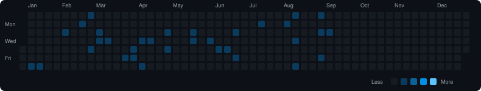
  <br/>
  <details>
    <summary><i>View Other Years Archive for 森本 茉莉</i></summary>
    <br/>
    <ul>
      <li><a href="public/images/contributions/morimoto.marie/2025.svg">Year 2025 Activity Calendar (57 blog posts)</a></li>
      <li><a href="public/images/contributions/morimoto.marie/2024.svg">Year 2024 Activity Calendar (79 blog posts)</a></li>
      <li><a href="public/images/contributions/morimoto.marie/2023.svg">Year 2023 Activity Calendar (90 blog posts)</a></li>
      <li><a href="public/images/contributions/morimoto.marie/2022.svg">Year 2022 Activity Calendar (98 blog posts)</a></li>
      <li><a href="public/images/contributions/morimoto.marie/2021.svg">Year 2021 Activity Calendar (113 blog posts)</a></li>
      <li><a href="public/images/contributions/morimoto.marie/2020.svg">Year 2020 Activity Calendar (82 blog posts)</a></li>
    </ul>
  </details>
</details>

<details>
  <summary><b>山口 陽世 (yamaguchi.haruyo) - Year 2026 Activity Calendar (27 blog posts)</b></summary>
  <br/>
  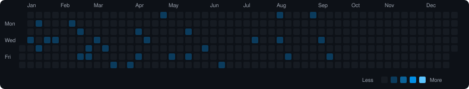
  <br/>
  <details>
    <summary><i>View Other Years Archive for 山口 陽世</i></summary>
    <br/>
    <ul>
      <li><a href="public/images/contributions/yamaguchi.haruyo/2025.svg">Year 2025 Activity Calendar (63 blog posts)</a></li>
      <li><a href="public/images/contributions/yamaguchi.haruyo/2024.svg">Year 2024 Activity Calendar (88 blog posts)</a></li>
      <li><a href="public/images/contributions/yamaguchi.haruyo/2023.svg">Year 2023 Activity Calendar (125 blog posts)</a></li>
      <li><a href="public/images/contributions/yamaguchi.haruyo/2022.svg">Year 2022 Activity Calendar (96 blog posts)</a></li>
      <li><a href="public/images/contributions/yamaguchi.haruyo/2021.svg">Year 2021 Activity Calendar (109 blog posts)</a></li>
      <li><a href="public/images/contributions/yamaguchi.haruyo/2020.svg">Year 2020 Activity Calendar (84 blog posts)</a></li>
    </ul>
  </details>
</details>

<details>
  <summary><b>山下 葉留花 (yamashita.haruka) - Year 2026 Activity Calendar (24 blog posts)</b></summary>
  <br/>
  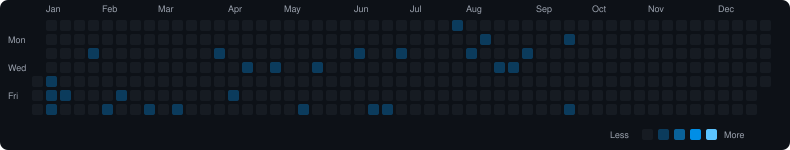
  <br/>
  <details>
    <summary><i>View Other Years Archive for 山下 葉留花</i></summary>
    <br/>
    <ul>
      <li><a href="public/images/contributions/yamashita.haruka/2025.svg">Year 2025 Activity Calendar (58 blog posts)</a></li>
      <li><a href="public/images/contributions/yamashita.haruka/2024.svg">Year 2024 Activity Calendar (78 blog posts)</a></li>
      <li><a href="public/images/contributions/yamashita.haruka/2023.svg">Year 2023 Activity Calendar (76 blog posts)</a></li>
      <li><a href="public/images/contributions/yamashita.haruka/2022.svg">Year 2022 Activity Calendar (5 blog posts)</a></li>
    </ul>
  </details>
</details>

<details>
  <summary><b>渡辺 莉奈 (watanabe.rina) - Year 2026 Activity Calendar (15 blog posts)</b></summary>
  <br/>
  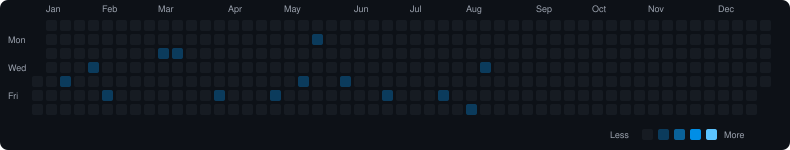
  <br/>
  <details>
    <summary><i>View Other Years Archive for 渡辺 莉奈</i></summary>
    <br/>
    <ul>
      <li><a href="public/images/contributions/watanabe.rina/2025.svg">Year 2025 Activity Calendar (49 blog posts)</a></li>
      <li><a href="public/images/contributions/watanabe.rina/2024.svg">Year 2024 Activity Calendar (50 blog posts)</a></li>
      <li><a href="public/images/contributions/watanabe.rina/2023.svg">Year 2023 Activity Calendar (46 blog posts)</a></li>
      <li><a href="public/images/contributions/watanabe.rina/2022.svg">Year 2022 Activity Calendar (5 blog posts)</a></li>
    </ul>
  </details>
</details>

<details>
  <summary><b>ポカ (poka) - Year 2026 Activity Calendar (39 blog posts)</b></summary>
  <br/>
  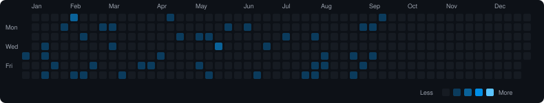
  <br/>
  <details>
    <summary><i>View Other Years Archive for ポカ</i></summary>
    <br/>
    <ul>
      <li><a href="public/images/contributions/poka/2025.svg">Year 2025 Activity Calendar (46 blog posts)</a></li>
      <li><a href="public/images/contributions/poka/2024.svg">Year 2024 Activity Calendar (56 blog posts)</a></li>
      <li><a href="public/images/contributions/poka/2023.svg">Year 2023 Activity Calendar (72 blog posts)</a></li>
      <li><a href="public/images/contributions/poka/2022.svg">Year 2022 Activity Calendar (96 blog posts)</a></li>
      <li><a href="public/images/contributions/poka/2021.svg">Year 2021 Activity Calendar (102 blog posts)</a></li>
    </ul>
  </details>
</details>


## Technical Setup

### Installation

Install the required Node.js dependencies:

```bash
npm install
```

### Local Development

Launch the interactive Vite development server locally:

```bash
npm run dev
```

### Run Crawler Manually

Trigger the incremental morphological compiler and image optimizer manually:

```bash
npm run crawl
```

### Build Production Bundle

Compile the TypeScript application and build the static production bundle:

```bash
npm run build
```
